<h1 align="center "><strong>Taller 2</strong></h1>

<strong>Jorge Esteban Triviño Correa</strong>

<h3><strong>1. Recuperación de contraseña del usuario root en linux fedora.</strong></h3>

Para iniciar se prende la maquina y se oprime una tecla para detener el arranque en el grub y se presiona la tecla <strong>e</strong>. 
 
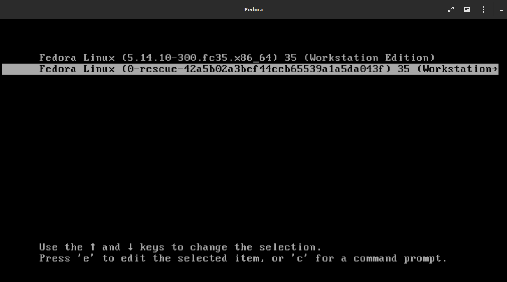
 

 
En la pantalla que aparece, se debe buscar la lines linux16 y reemplazar la sentencia <strong>rhgb quiet</strong> por <strong>rd.break</strong>.
 
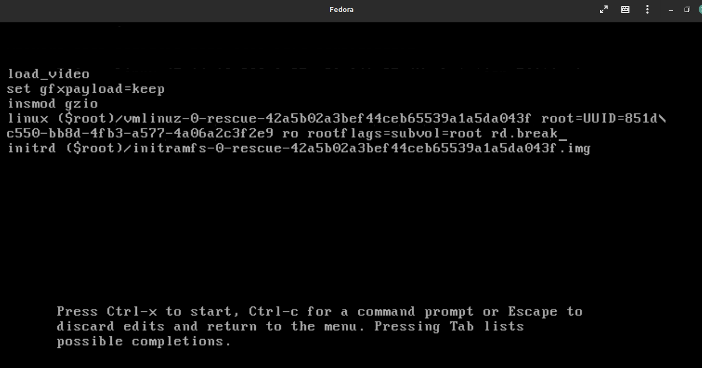

 
Posterior a realizar el cambio, se debe presionar las teclas <strong>control x </strong>para abrir el terminal y posteriormente oprimir la tecla <strong>enter</strong>.
 
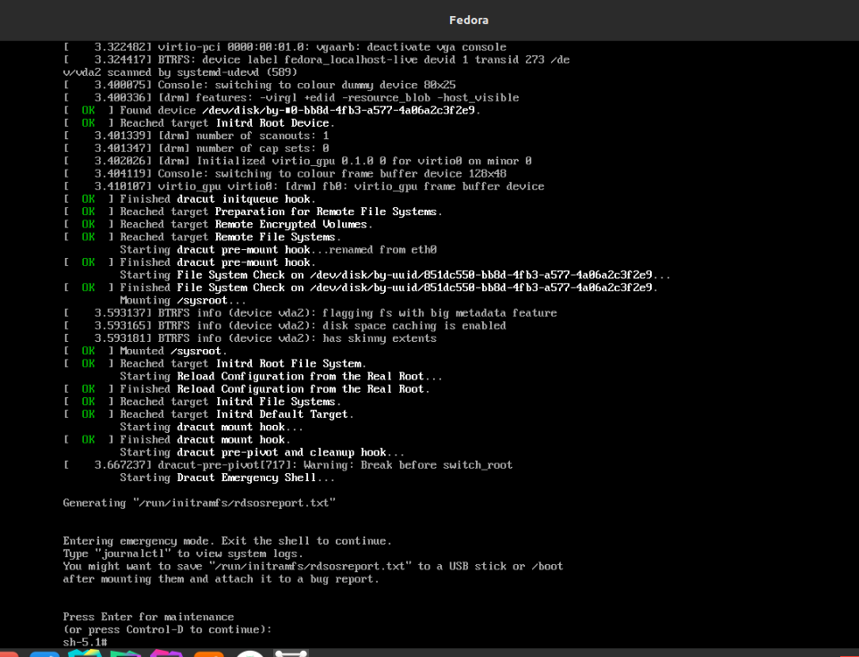

 
Una vez ingresado al terminal, se ingresa el comando <strong>mount</strong>.
 
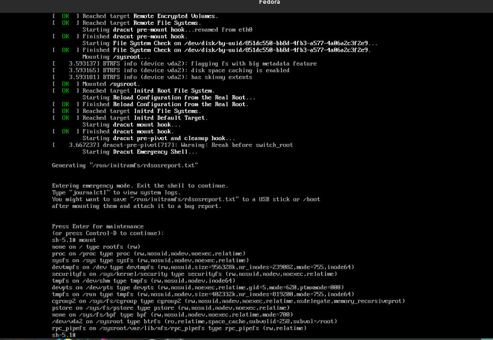

 
Luego, se ingresa el comando <strong>mount -o rw,remount /sysroot/</strong>
 
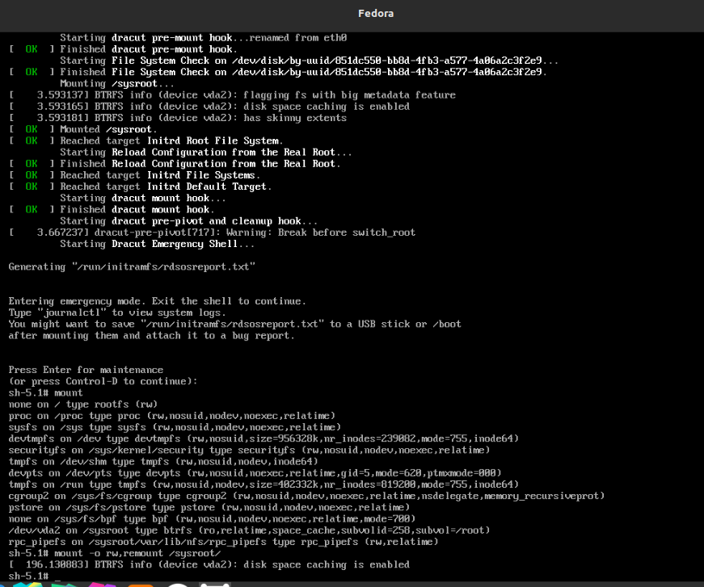

 
Luego, se ingresa el comando <strong>mount</strong> para verificar que ya esten los permisos de escritura
 
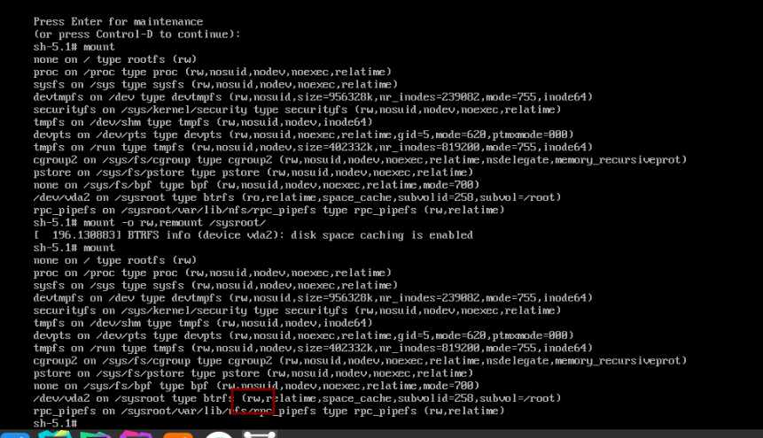

 
Luego, se ingresa el comando <strong>chroot /sysroot/ </strong>
 
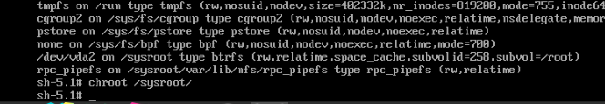

 
Luego, se ingresa el comando <strong>passwd</strong> y se ingresa la nueva contraseña del usuario root por la contraseña (linux12345)
 
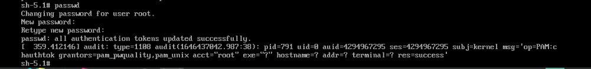

 
Luego, se ingresa el comando <strong>touch /.autorelabel</strong>
 
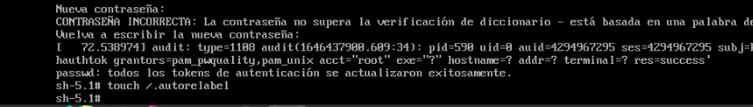
 

Luego, se ingresa el comando <strong>exit</strong> dos veces.

Se espera a que el equipo reinicie y se inicia sesión con el usuario root y la nueva contraseña.
 
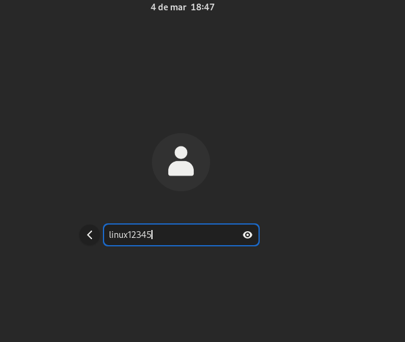
 

 

<h3>2. Mover directorios a través de terminal usando el comando <strong>mv [nombreArchivo] [Ruta Donde Se Quiere Guardar]</strong> en linux fedora.</h3>
Se deben crear las carpetas de Bisabuelo y Bisabuela:
 
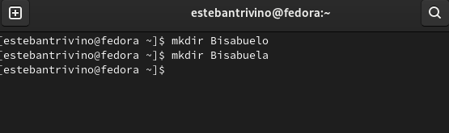
 

Se mueve la carpeta de Abuelo a la carpeta de Bisabuela y la carpeta Abuela a la carpeta Bisabuelo:
 
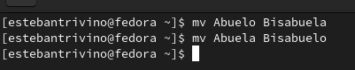
 

Se mueve el archivo (Andres.txt) de Abuelo a la carpeta de Abuela y el archivo (Maria.txt) de la carpeta Abuela a la carpeta de Abuelo
 
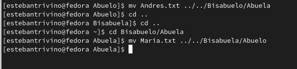
 

Se mueve el archivo (Julian.txt) de Padre a la carpeta de Madre y el archivo (Alejandra.txt) de la carpeta Madre a la carpeta de Padre
 
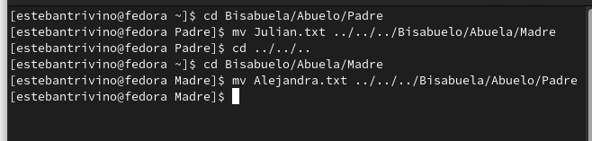
 

Se mueve el archivo (Jorge.txt) de Hijo a la carpeta de Madre y el archivo (Andrea.txt) de la carpeta Hija a la carpeta de Hijo
 

 

Se crean los directorios de Nieto dentro de la carpeta Hijo y Nieta dentro de la carpeta Hija, posterior a eso se crea una archivo .txt con la información del nieto y la nieta:
 
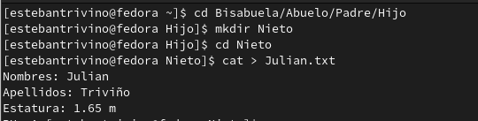
 
 
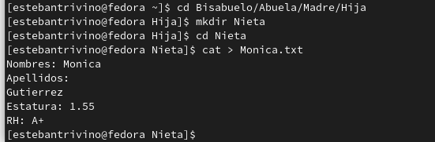
 

Se crean los directorios de Bisnieto dentro de la carpeta Nieto y Bisnieta dentro de la carpeta Nieta, posterior a eso se crea una archivo .txt con la información del Bisnieto y la Bisnieta:
 
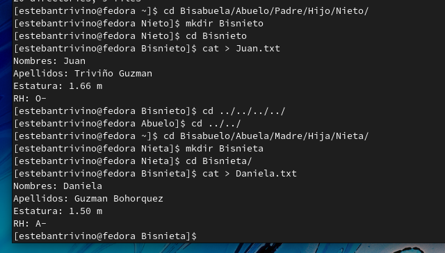
 

Se mueve el archivo (Julian.txt) de Nieto a la carpeta de Nieta y el archivo (Juan.txt) de la carpeta Bisnieto a la carpeta de Bisnieta
 
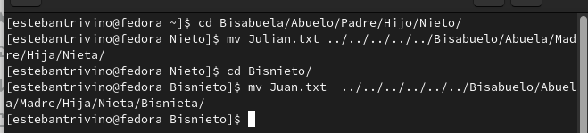
  

Se mueve el archivo (Monica.txt) de Nieta a la carpeta de Nieto y el archivo (Daniela.txt) de la carpeta Bisnieta a la carpeta de Bisnieto
 
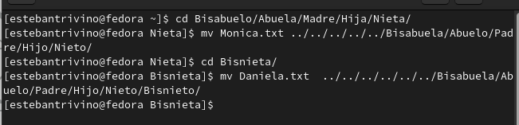
  

Se ejecuta el comando <strong>tree</strong> para revisar la estructura final del directorio.
 
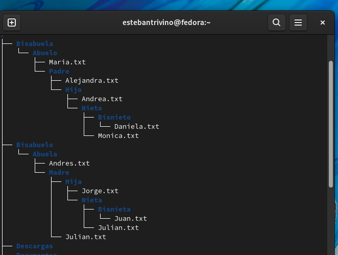
  