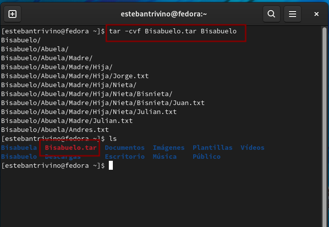
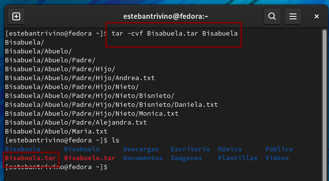

<h1 align="center "><strong>Taller 3</strong></h1>

<strong>Jorge Esteban Triviño Correa</strong>

<h3><strong>1.1 Comprimir el directorio Bisabuelo y Bisabuela en formato tar.</strong></h3>

Para iniciar se prende la maquina y se oprime una tecla para detener el arranque en el grub y se presiona la tecla <strong>e</strong>. 
 

 

<h3><strong>1.2 Comprimir el directorio Bisabuelo y Bisabuela en formato tar.gz, bz2.</strong></h3>

Para iniciar se prende la maquina y se oprime una tecla para detener el arranque en el grub y se presiona la tecla <strong>e</strong>. 
 

 

<h3><strong>2. Listar los archivos comprimidos.</strong></h3>

Para iniciar se prende la maquina y se oprime una tecla para detener el arranque en el grub y se presiona la tecla <strong>e</strong>. 
 

 

<h3><strong>3. Descomprimir los directorios /Bisabuelo y /Bisabuela en las siguientes rutas:/tmp y /root</strong></h3>

Para iniciar se prende la maquina y se oprime una tecla para detener el arranque en el grub y se presiona la tecla <strong>e</strong>. 
 

 

<h3><strong>4. Comprimir los directorios usando la herramienta o paquete (zip, unzip) y descomprimir.</strong></h3>

Para iniciar se prende la maquina y se oprime una tecla para detener el arranque en el grub y se presiona la tecla <strong>e</strong>. 
 

 

<h3><strong>5. RETO: Realizar un script en bash shell que haga la copia de seguridad del directorio /etc a las 24h todos los dias.</strong></h3>

Para iniciar se prende la maquina y se oprime una tecla para detener el arranque en el grub y se presiona la tecla <strong>e</strong>. 
 

 
