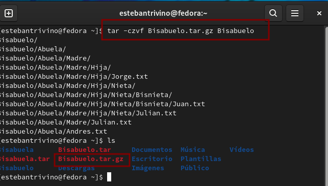
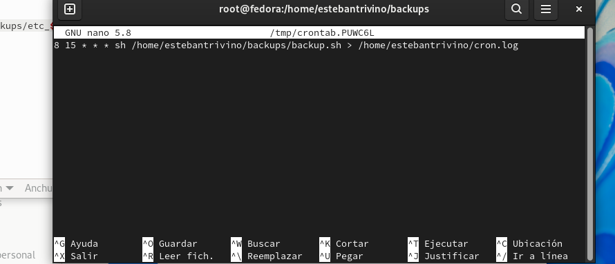
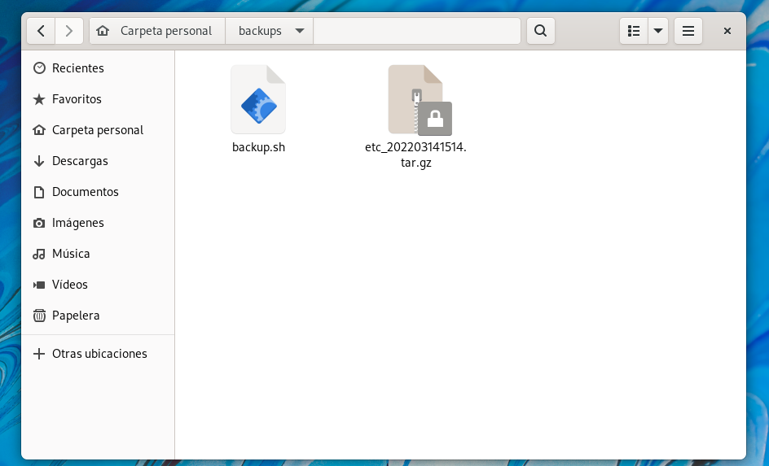

<h1 align="center "><strong>Taller 3</strong></h1>

<strong>Jorge Esteban Triviño Correa</strong>

<h3><strong>1.1 Comprimir el directorio Bisabuelo y Bisabuela en formato tar.</strong></h3>

Se ejecuta el comando <strong>tar -cvf Bisabuelo.tar Bisabuelo</strong> para crear el archivo comprimido en tar de la carpeta Bisabuelo. 
 

Se ejecuta el comando <strong>tar -cvf Bisabuela.tar Bisabuela</strong> para crear el archivo comprimido en tar de la carpeta Bisabuela. 
 

<h3><strong>1.2 Comprimir el directorio Bisabuelo y Bisabuela en formato tar.gz, bz2.</strong></h3>

Se ejecuta el comando <strong>tar -czvf Bisabuelo.tar.gz Bisabuelo</strong> para crear el archivo comprimido en tar.gz de la carpeta Bisabuelo. 
 

Se ejecuta el comando <strong>tar -cvf Bisabuela.tar.gz Bisabuela</strong> para crear el archivo comprimido en tar.gz de la carpeta Bisabuela. 
 

Se ejecuta el comando <strong>tar -cvf Bisabuelo.tar.bz2 Bisabuelo </strong> para crear el archivo comprimido en bz2 de la carpeta Bisabuelo. 
 

Se ejecuta el comando <strong>tar -cvf Bisabuela.tar.bz2 Bisabuela</strong> para crear el archivo comprimido en tar.bz2 de la carpeta Bisabuela. 
 

<h3><strong>2. Listar los archivos comprimidos.</strong></h3>

Para ver el listado de los archivos comprimidos se usa el comando <strong>ls -lh Bis*</strong>. 
 

Para ver los elementos que tiene un archivo comprimido en tar se usa el comando <strong>tar -tvf Bisabuelo.tar</strong>. 
 

Para ver los elementos que tiene un archivo comprimido en tar.gz se usa el comando <strong>tar -tvf Bisabuelo.tar.gz</strong>. 
 

Para ver los elementos que tiene un archivo comprimido en tar.bz2 se usa el comando <strong>tar -tvf Bisabuelo.tar.gz</strong>. 
 

<h3><strong>3. Descomprimir los directorios /Bisabuelo y /Bisabuela en las siguientes rutas:/tmp y /root</strong></h3>

Para descomprimir un archivo comprimido en la ruta /tmp se usa el comando <strong>tar -xvf Bisabuelo.tar -C ../../temp</strong>. 
 

Para descomprimir un archivo comprimido en la ruta /root se usa el comando <strong>sudo tar -xvf Bisabuelo.tar -C ../../root</strong>. 
 

Para ingresar a la carpeta de root se debe acceder al usuario de raiz con el comando <strong>sudo su</strong>. 
 

<h3><strong>4. Comprimir los directorios usando la herramienta o paquete (zip, unzip) y descomprimir.</strong></h3>

Para comprimir la carpeta de Bisabuelo con zip se debe utilizar el comando <strong>zip -r Bisabuelo.zip Bisabuelo</strong>. 
 

Para descomprimir el archivo de Bisabuelo.zip con unzip se debe utilizar el comando <strong>unzip Bisabuelo.zip</strong> y se selecciona si se desea o no reemplazar el archivo con el mismo nombre. 
 

<h3><strong>5. RETO: Realizar un script en bash shell que haga la copia de seguridad del directorio /etc a las 24h todos los dias.</strong></h3>

Se inicia con la creación del script con el comando para comprimir el archivo tar y añadirle la fecha.
 

Para que el servidor ejecute el script cada día se añade un nuevo registro al crontab, el crontab permite indicar tareas que se ejecutarán de forma periódica en lapsos determinados.

Para acceder al crontab se ejecuta el comando <b>crontab -e</b>
 

Para añadir la tarea recurrente se escribe lo siguiente:
 

Para comprobar la ejecución del script nos dirigimos a la carpeta donde se almacenan los backups y se verifica que haya sido creado:
 
