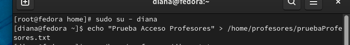
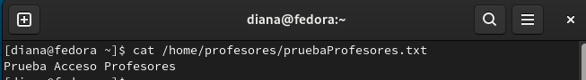
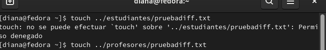
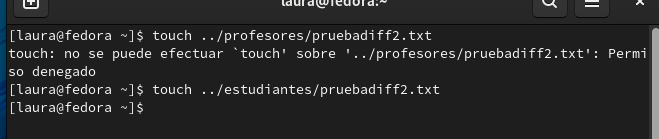
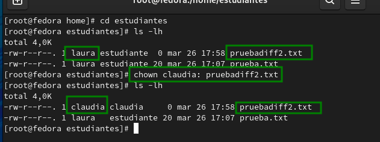
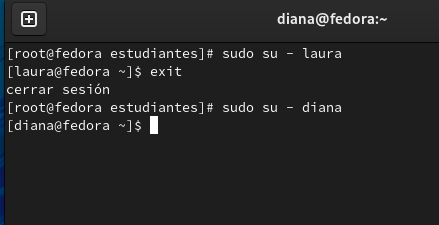
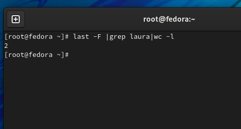
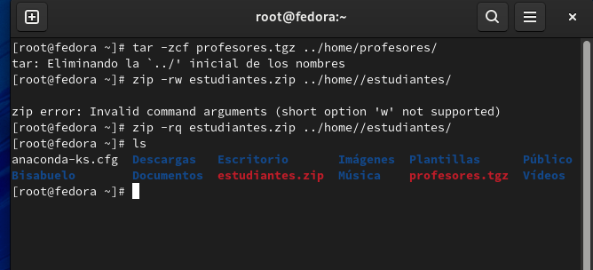
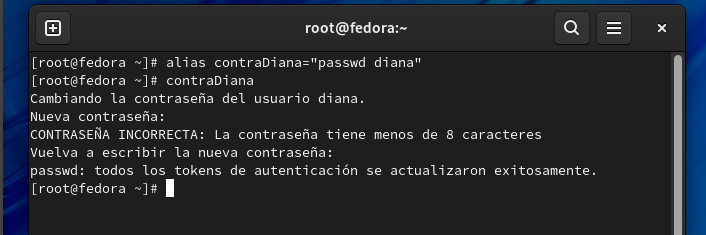

<h1 align="center ">Taller 4</h1>

Jorge Esteban Triviño Correa

<h3>1. Crear dos grupos llamados profesor y estudiante.</h3>

Se ejecuta el comando `groupadd -r profesor` y `groupadd -r estudiante` para crear los dos grupos desde el usuario root. 
 

Se ejecuta el comando `tail -n 5 /etc/group ` para verificar que la creación de los grupos quedaron bien creados.
 

<h3>`2. Crear tres usuarios llamados: diana, claudia y laura.`</h3>

Se ejecuta el comando `useradd diana`  `useradd claudia`  `useradd laura`  para crear los usuarios. 
 

Se ejecuta el comando `tail -n 3 /etc/passwd ` para verificar que la creación de los usuarios quedaron bien creados.
 

<h3>`3. Conociendo que: diana es un profesor; laura es una estudiante y claudia es un profesor y un estudiante. Adicione todos los usuarios a los grupos correspondientes.`</h3>

Se ejecutan los comandos `usermod -g profesor diana` `usermod -g estudiante laura` `usermod -a -G estudiante claudia` `usermod -a -G profesor claudia`
 

Se ejecutan los comando `group diana` `group laura` y `group claudia` para verificar los grupos de cada una.
 

<h3>4. Cree dos directorios, uno para profesores (solo los profesores tienen acceso) y otro para
estudiantes (profesores y estudiantes tienen acceso). Asegúrese de asignar los permisos.</h3>

Se ejecutan los siguientes comandos `mkdir /home/profesores` y `mkdir /home/estudiantes` para crear los directorios, posteriormente se le asignan los permisos para cada grupo con los comandos `chgrp profesor /home/profesores` y `chmod  ug+rwx /home/profesores y chmod o-rwx /home/profesores`, los anteriores comandos se utilizan para asignar la carpeta al grupo que se desea y para darle los permisos a dicha carpeta respectivamente. Del mismo modo se realiza la asignación del grupo estudiantes con los siguientes comandos `chgrp estudiante /home/estudiantes` y `chmod -R ug=rwx, o= /home/estudiantes`.
 

<h3>5. Verifique los permisos anteriores, usando las cuentas de los usuarios ya creados.</h3>

Para verificar los permisos se ejecutan los siguientes comandos `sudo su - laura` para acceder al usuario de laura, `echo "Prueba Acceso Laura" > ../estudiantes/prueba.txt` para probar el permiso de escritura por parte de laura.
 

Para verificar los permisos se ejecutan los siguientes comandos `sudo su - diana` para acceder al usuario de diana, `echo "Prueba Acceso Profesores" > ../profesores/pruebaProfesores.txt` para probar el permiso de escritura por parte de diana.
 

 

<h3>6. Use un editor de texto para crear archivos en los respectivos directorios, usando diferentes usuarios.</h3>

Se ejecutan los siguientes comandos `touch ../estudiantes/pruebadif.txt` y `touch ../profesores/pruebadif.txt` desde el perfil de laura y desde el perfil de diana.
 

 

<h3>7. Como super usuario, cambie de dueño los archivos creados.</h3>

Para el cambio de pertenencia de un archivo de un usuario a otro se ejecuta el comando `chown -R [nuevoDueño]: /[direccionArchivo]`
 

<h3>8. Usando diferentes terminales, entre al sistema con los diferentes usuarios:(equivoquese algunas veces por completo).</h3>

Para iniciar sesión con un usuario se utiliza el comando `sudo su - [nombreUsuario]`.
 

<h3>9. Usando diferentes terminales, entre al sistema con los diferentes usuarios:(equivoquese algunas veces por completo).</h3>

Para iniciar sesión con un usuario se utiliza el comando `sudo su - [nombreUsuario]`.
 

<h3>10. Determine la cantidad de veces que el estudiante laura ingreso al sistema.</h3>

Para verificar cuantas veces un usuario ha ingresado al sistema se utiliza el comando `last -F |grep laura | wc -l`
 

<h3>11. Comprima el contenidos del directorio de los profesores en profesore.tgz y el contenido del directorio de los estudiante en un archivo estudiantes.zip.</h3>

Para comprimir con tgz los archivos se ejecuta el comando `tar -zcf [nombre_archivo_comprimido].tgz [direccion_Archivo]`, para comprimir con zip se ejecuta el comando `zip -rq [nombre_archivo_comprimido].zip [direccion_Archivo]`
 

<h3>12. Cree un alias para cambiar la clave del usuario diana.</h3>

Para crear el alias que permita cambiar la contraseña del usuario diana ejecutamos el siguiente comando: `alias contraDiana="passwd diana"`.
 

