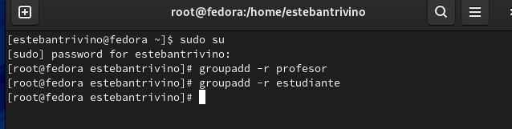
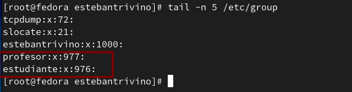
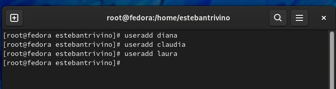
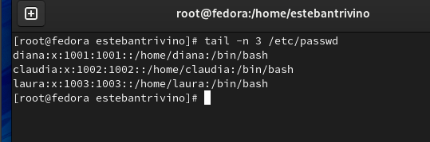
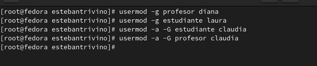
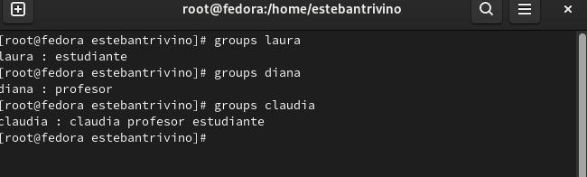
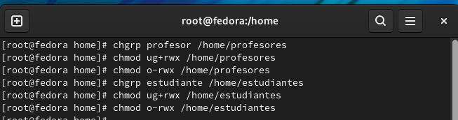
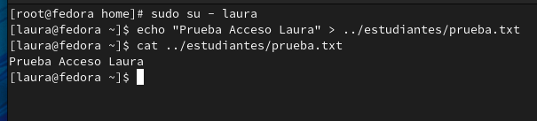

<h1 align="center "><strong>Taller 4</strong></h1>

<strong>Jorge Esteban Triviño Correa</strong>

<h3><strong>1. Crear dos grupos llamados profesor y estudiante.</strong></h3>

Se ejecuta el comando <strong>groupadd -r profesor</strong> y <strong>groupadd -r estudiante</strong> para crear los dos grupos desde el usuario root. 
 

Se ejecuta el comando <strong>tail -n 5 /etc/group </strong> para verificar que la creación de los grupos quedaron bien creados.
 

<h3><strong>2. Crear tres usuarios llamados: diana, claudia y laura.</strong></h3>

Se ejecuta el comando <strong>useradd diana</strong>  <strong>useradd claudia</strong>  <strong>useradd laura</strong>  para crear los usuarios. 
 

Se ejecuta el comando <strong>tail -n 3 /etc/passwd </strong> para verificar que la creación de los usuarios quedaron bien creados.
 

<h3><strong>3. Conociendo que: diana es un profesor; laura es una estudiante y claudia es un profesor y un estudiante. Adicione todos los usuarios a los grupos correspondientes.</strong></h3>

Se ejecutan los comandos <strong>usermod -g profesor diana</strong> <strong>usermod -g estudiante laura</strong> <strong>usermod -a -G estudiante claudia</strong> <strong>usermod -a -G profesor claudia</strong>
 

Se ejecutan los comando <strong>group diana</strong> <strong>group laura</strong> y <strong>group claudia</strong> para verificar los grupos de cada una.
 

<h3><strong>4. Cree dos directorios, uno para profesores (solo los profesores tienen acceso) y otro para
estudiantes (profesores y estudiantes tienen acceso). Asegúrese de asignar los permisos.</strong></h3>

Se ejecutan los siguientes comandos <strong>mkdir /home/profesores</strong> y <strong>mkdir /home/estudiantes</strong> para crear los directorios, posteriormente se le asignan los permisos para cada grupo con los comandos <strong>chgrp profesor /home/profesores</strong> y <strong>chmod  ug+rwx /home/profesores y chmod o-rwx /home/profesores</strong>, los anteriores comandos se utilizan para asignar la carpeta al grupo que se desea y para darle los permisos a dicha carpeta respectivamente. Del mismo modo se realiza la asignación del grupo estudiantes con los siguientes comandos <strong>chown -R laura:estudiante /home/estudiantes</strong> y <strong>chmod -R ug=rwx, o= /home/estudiantes</strong>.
 

 
