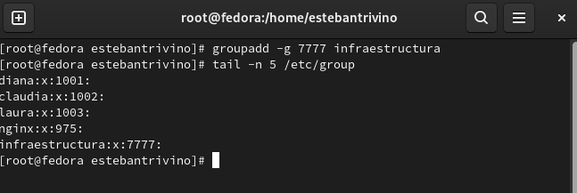
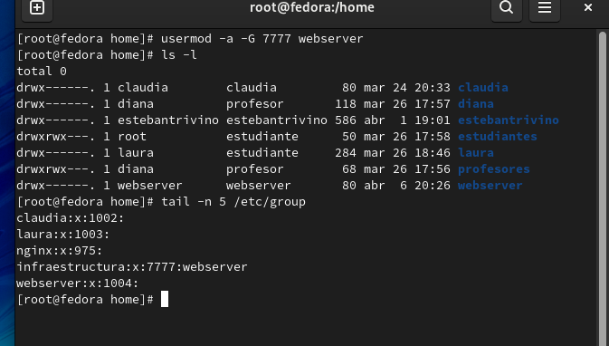
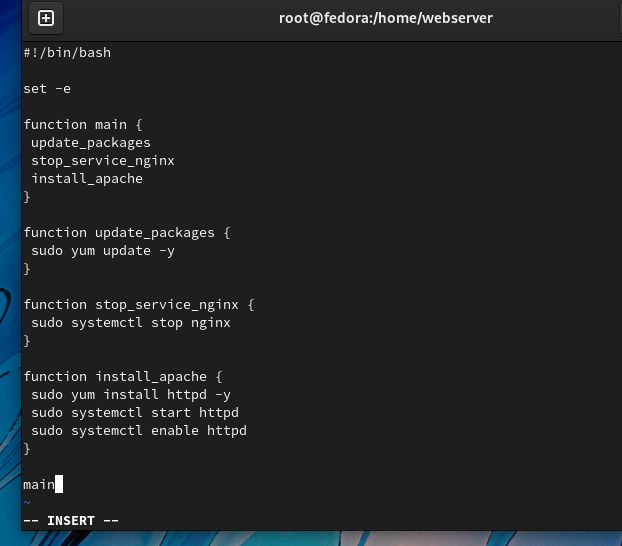
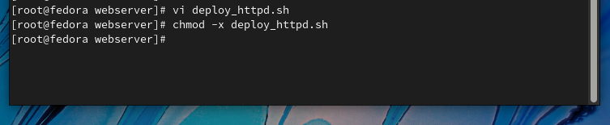
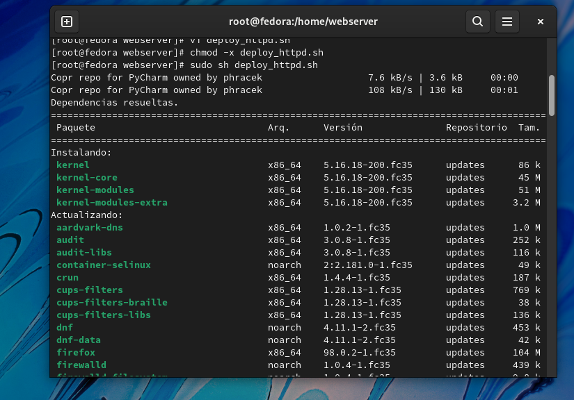
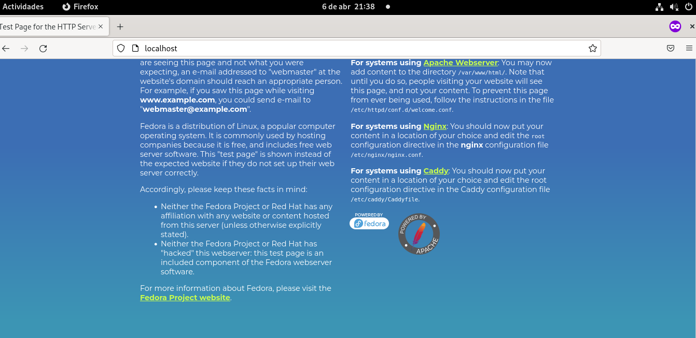

<h1 align="center ">Taller 6</h1>

Jorge Esteban Triviño Correa

<h3>1. Crear un grupo llamado infraestructura con gid 7777.</h3>

Se ejecuta el comando `groupadd -g 7777 infraestructura` para crear el grupo infraestructura desde el usuario root y ejecutamos el comando `tail -n 5 /etc/group ` para comprobar que el grupo haya sido creado correctamente. 
 

<h3>2. Crear un usuario llamado webserver que pertenezca al grupo infraestructura.</h3>

Se ejecuta el comando `useradd webserver` para crea el usuario, posteriormente, se ejecuta el comando `useradd -a -G 7777 webserver`, luego, ejecutamos el comando `tail -n 5 /etc/group ` para verificar que el usuario este añadido al grupo. 
 

 

<h3>3. Detener el servicio nginx ( systemctl stop nginx ).</h3>

Se realiza la creación del script: 
 

Se ejecutan le dan los permisos de escritura al script realizado con el comando  `sudo chmod +x [ nombreScript ]`.
 

Se ejecuta el script con permisos de usuario root con el comando `sudo sh [nombreScript]`.
 

<h3>4. Usar el script anterior y cambiar el paquete nginx por httpd -> el usuario webserver debe ser el propietario.</h3>

Se realiza el siguiente script:
 

Se ejecuta el script con permisos de usuario root con el comando `sudo sh [nombreScript]`.
 

Se revisa la ejecución del servicio de apache en la web:
 
