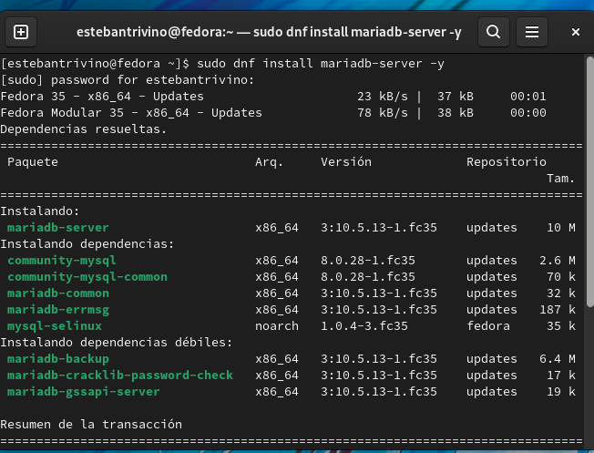
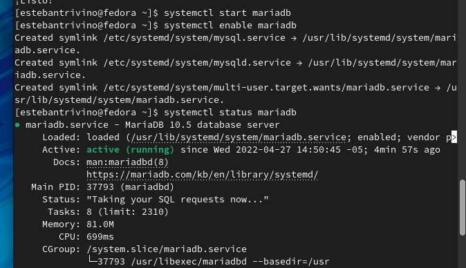
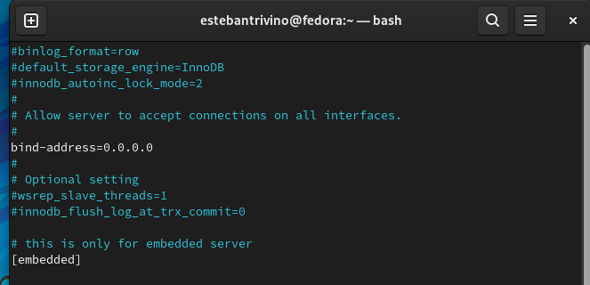
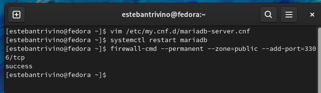
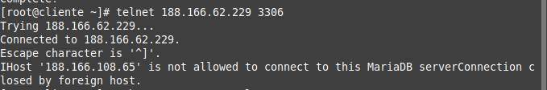

<h1 align="center ">Taller 7 - Conexión cliente/servidor</h1>

Jorge Esteban Triviño Correa

<h3>1. Instalar Mysql en el servidor .</h3>

Para realizar la instalación de MariaDB (Sistema de gestión de base de datos derivado de MySQL) se ejecuta el comando `sudo dnf install mariadb-server -y`. 
 

Posteriormente, se inicia el servicio de la base de datos con el comando `systemctl start mariadb`, luego, se ejecuta el comando `systemctl enable mariadb` para que el servicio se ejecute persistentemente. Para finalizar, se ejecuta el comando `systemctl status mariadb` para verificar que el servicio este activo. 
 

<h3>2. Configuración del servidor para permitir conexiones remotas.</h3>

Primero configuramos el servidor de bases de datos para permitir las conexiones remotas, para ello se utiliza el siguiente comando (`vim /etc/my.cnf.d/mariadb-server.cnf`) para editar el archivo de configuración del MariaDB y en el campo bind-address colocamos un valor de 0.0.0.0. Posteriormente se reinicia el servidor con el comando `systemctl restart mariadb`. Luego, se utiliza el comando `firewall-cmd --permanent --zone=public --add-port=3306/tcp` para abrir el puerto 3306 en el firewall.
 

 

<h3>4. Realizar la conexión al puerto 3306 desde el cliente al servidor.</h3>

Se realiza la conexión desde el cliente al servidor por el puerto 3306 utilizando el comando `telnet [ip_address] [port_number]`. Se evidencia la conexión con el servidor cuando aparece que ya esta conectado el cliente. 
 
