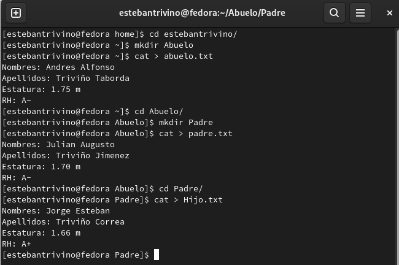
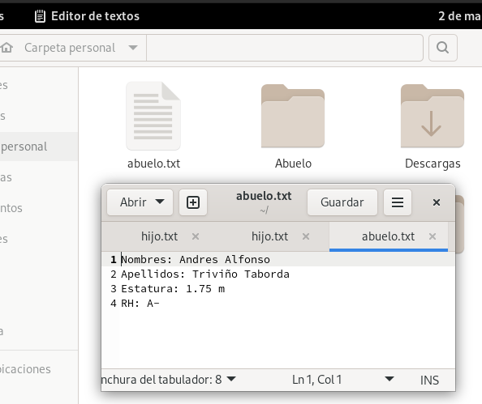
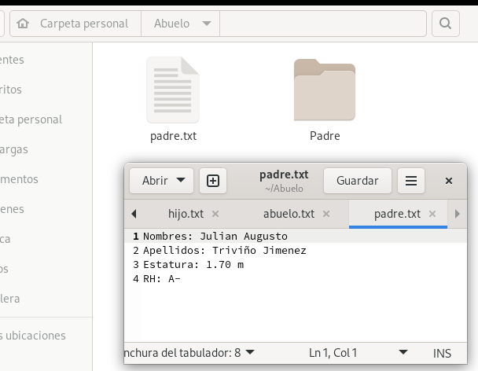
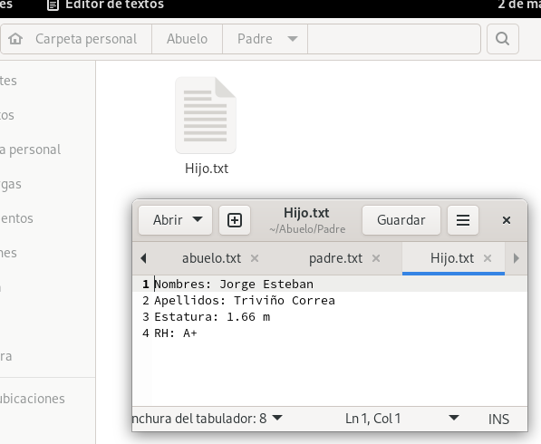
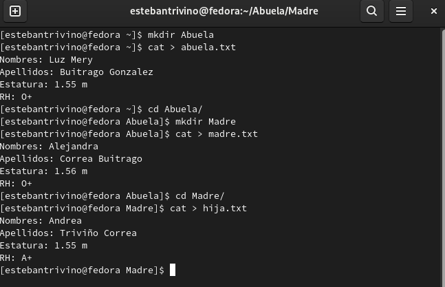
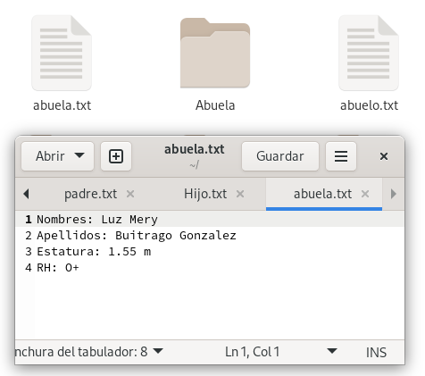
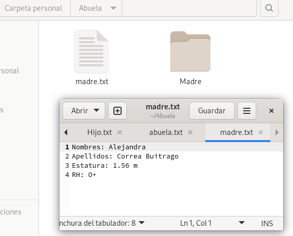
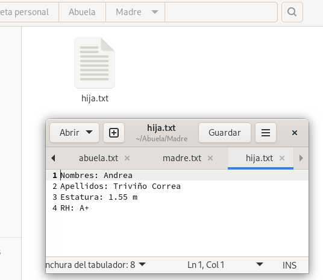
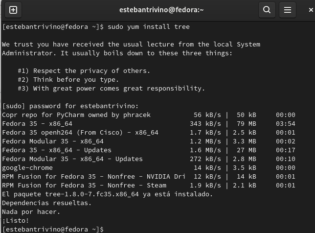
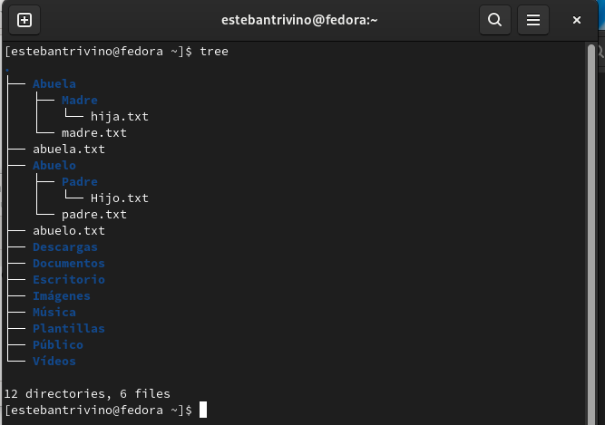

# Taller I (Linux 1)

<b>_Jorge Esteban Triviño Correa 25-02-2022_</b>

## 1. Dirigirse al `/home/user` del usuario creado y con los comandos anteriormente vistos en clase, crear la siguiente lista de carpetas.

`Abuelo/Padre/Hijo` : Para realizar esto debemos usar el comando <strong>mkdir nombrecarpeta</strong>, posteriormente, se utiliza el comando cat > [Nombre del archivo.txt] y se añade la información que se desea guardar, una vez escrita la información se utiliza el comando Control D para guardar los cambios y salor. A continuación se anexan las evidencias del trabajo realizado: 

`Abuela/Madre/Hija` :  Para realizar esto debemos usar el comando <bstrong>mkdir nombrecarpeta</bstrong>, posteriormente, se utiliza el comando <strong> cat > [Nombre del archivo.txt] </strong> y se añade la información que se desea guardar, una vez escrita la información se utiliza el comando Control D para guardar los cambios y salor. A continuación se anexan las evidencias del trabajo realizado: 

## 2. Instalar el paquete `tree` y ejecutarlo en el directorio del usuario.

Para instalar el paquete `tree` se hace uso del gestor de paquetes _yum_ usando el comando `yum install tree -y` el paquete tree muestra en consola la estructura en forma de arbol de las carpetas que tiene en conjunto con los archivos que estos directorios contienen.

Instalando del paquete tree

Cuando termine la instalación del paquete solo queda usar el comando dentro de la carpeta del usuario para observar su funcionalidad para visualizar la estructura de carpetas desde la terminal en forma de árbol:

