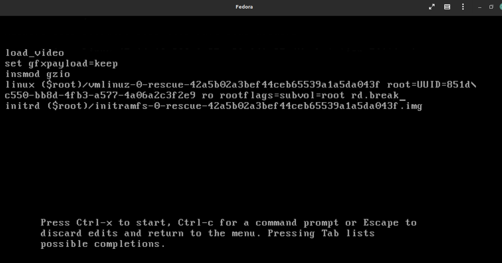

<h1 align="center ">Taller 2 (Linux 1)</h1>

<b>Jorge Esteban Triviño Correa</b>

## 1. Recuperación de contraseña del usuario root en linux fedora.

Para iniciar se prende la maquina y se oprime una tecla para detener el arranque en el grub y se presiona la tecla (e). 

En la pantalla que aparece, se debe buscar la lines linux16 y reemplazar la sentencia rhgb quiet por rd.break.

Posterior a realizar el cambio, se debe presionar las teclas control x para abrir el terminal y posteriormente oprimir la tecla enter.

Una vez ingresado al terminal, se ingresa el comando mount.

Luego, se ingresa el comando mount -o rw,remount /sysroot/

Luego, se ingresa el comando mount para verificar que ya esten los permisos de escritura

Luego, se ingresa el comando chroot /sysroot/

Luego, se ingresa el comando passwd y se ingresa la nueva contraseña del usuario root por la contraseña (linux12345)

Luego, se ingresa el comando touch /.autorelabel

Luego, se ingresa el comando exit dos veces.

Se espera a que el equipo reinicie y se inicia sesión con el usuario root y la nueva contraseña.

## 2. Mover directorios a través de terminal usando el comando <strong>mv [nombreArchivo] [Ruta Donde Se Quiere Guardar]</strong> en linux fedora.
Se deben crear las carpetas de Bisabuelo y Bisabuela:

Se mueve la carpeta de Abuelo a la carpeta de Bisabuela y la carpeta Abuela a la carpeta Bisabuelo:

Se mueve el archivo (Andres.txt) de Abuelo a la carpeta de Abuela y el archivo (Maria.txt) de la carpeta Abuela a la carpeta de Abuelo

Se mueve el archivo (Julian.txt) de Padre a la carpeta de Madre y el archivo (Alejandra.txt) de la carpeta Madre a la carpeta de Padre

Se mueve el archivo (Jorge.txt) de Hijo a la carpeta de Madre y el archivo (Andrea.txt) de la carpeta Hija a la carpeta de Hijo

Se crean los directorios de Nieto dentro de la carpeta Hijo y Nieta dentro de la carpeta Hija, posterior a eso se crea una archivo .txt con la información del nieto y la nieta:

Se crean los directorios de Bisnieto dentro de la carpeta Nieto y Bisnieta dentro de la carpeta Nieta, posterior a eso se crea una archivo .txt con la información del Bisnieto y la Bisnieta:

Se mueve el archivo (Julian.txt) de Nieto a la carpeta de Nieta y el archivo (Juan.txt) de la carpeta Bisnieto a la carpeta de Bisnieta
 

Se mueve el archivo (Monica.txt) de Nieta a la carpeta de Nieto y el archivo (Daniela.txt) de la carpeta Bisnieta a la carpeta de Bisnieto
 